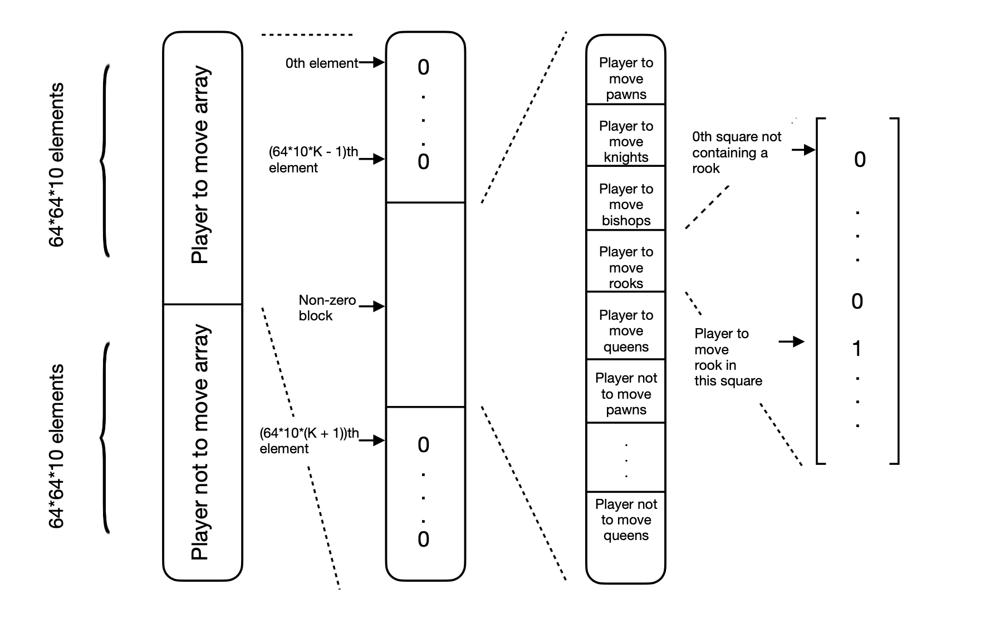

# Tals Hand

In this project I will create a chess engine from scratch. Classical chess engines usually consist of 3 main parts:

* A move generator, generating all legal moves in a chess position
* A function that evaluates positions (Possibly a neural network)
* An algorithm that searches in the variations and chooses the best move

I have created my own move generator, taking into account all the rules of chess and implementing bitboards (representing chess boards using length 64 bits). Speed in this part of the engine is essential because the engine will have to calculate many variations and chess is usually played with time limtis.

When evaluating positions, I use a neural network. Since speed is very important we can't use any neural network to evaluate positions, there are a special type of nerual networks called efiiciently updatable neural networks (NNUE) which are fast enough for chess engines and can be trained to evaluate positions to a very high level. 

My Neural Network implementation uses SIMD instructions (currently only compatible for ARM_NEON registers, hopefully I will include compatibility for SSSE3 and AVX registers). This allows to perform matrix computations in parallel, making the NN forward pass highly efficient.

There are many choices of search algorithms for chess engines (in general most 2 player games), however alpha-beta pruning is the most efficient, because it prunes branches of the tree search that one doesn't need to search. 

I have also applied quiescence search so that in tactical positions (when there are possible captures) it makes captures (I want to include some checks) until a quiet position is reached.

A common technique to implement with alpha-beta pruning is iterative deepening. It consists of performing iterative searches of increasing depths. Which allow for fast move ordering using the transposition table at low depths making higher depths more efficient.

When searching for moves I have added a score to moves depending on capturing pieces, making checks and move safety. The algorithm is contructed such that it considers high score moves first, making it faster because it prunes more branches. 

I have also included a principal variation (PV) searchm and non-PV search, where moves are generated differently. Trying to generate less moves for positions which will likely produce a cutoff.

The engine updates internally a Zobrist key each time a move is made, these keys correspond to the positions almost uniquely. The keys allow to efficiently check for threefold repetitions, and a transposition table in which the evaluation, best move and move type (see ttable.h) are stored for each zobrist key.

The transposition table makes it possible to check for principal variation nodes. These are positions which are a result of the best move played (from engine's point of view) previously within the search tree. These allows to perform a principal variation search, searching mor thoroughly after a principal variation move, and less thoroughly otherwise.

To play a game against the engine, download this repository and you can load the engine to any UCI compatible chess GUI (such as BANKSIAGUI). You can also play against the engine on Lichess https://lichess.org/@/LaManodeTal.

Hope you enjoy and beat the engine :)

To do:
* Pruning at shallow depth 
* Search extensions
* Late move reductions / extensions

* Futility pruning
* Null move pruning
* Internal Iterative deepening

Tried but didn't improve engine:
* Killer moves

# NNUEU (Ultra Efficiently Updatable Neural Networks)

## Abstract

Here I propose a new type of Neural Network for chess, which follows the ideas of https://github.com/ynasu87/nnue/blob/master/docs/nnue.pdf.

## Introduction

When choosing a best move, chess programs have to statically evaluate a huge number of positions in short time periods, hence finding an efficient and accurate static evaluation function is crucial for a chess engine. One could build a static evaluation function which takes into account some variables we extract from the position (e.g. attacked pieces, unportected pieces, ...). These manual evaluation functions where the most popular type of functions chosen for chess engines. 

However it was already known that one could train a neural network (NN) on static positions and evaluate even more precisely the positions. The problem with NNs was that they seemed to be too slow.

In ?? Y.Nasu proposed a new neural network architecture, Efficiently Updatable Neural Nertworks (NNUE), they where designed secifically for board games, in particular Shogi and Chess. They performed much better than all static evaluation functions that had been tried at the moment. 

## NNUE Input representation

For the rest of this article we assume squares in the chess board are relative to the player whose turn is. For example if it is white's turn a1 = 0 and h8 = 63, if it is black's turn a1 = 56, h8 = 0.

Since we are dealing with linear layers, our input vector has to be one dimensional. We could build a 64 * 12 length input, were the first 64 elements represent where player to move pawns are, the next 64 elements the player to move knights, and so on for all 6 piece types and different colors. This would work just fine, however it was noticed that the king positions are crucial features when statically evaluating chess positions, so the following input of length (64 * 64 * 10 * 2) was proposed and it is still currently used up to this day by many chess engines:

* Assume the input is divided into 64 * 2 subvectors of length 64 * 10. All these subvectors are set to zero, except for the ith and jth, where i = player_to_move_king_position and j = player_not_to_move_king_position + 64. 

* Inside these subvectors we can do as where the first 64 elements represent where player to move pawns are, the next 64 elements the player to move knights, and so on for all 5 piece types (excluding king) and different colors.

This input implementation showed to be much better at evaluating positions and still fast enough for chess engines. Making the overall performance better. 

## Accumulation

NNUE are Neural Networks composed of fully connected linear layers, which perform an efficient forward pass on the first layer. This efficient forward pass on the first layer can be performed because inputs vary on a couple of elements only from position to position after making a move. 

Let $A$ be the weight matrix of the first layer in our NNUE, if we have an initial position whose input vector is $x_1$, after the first layer forward pass we obtain a new vector $y_1 = x_1 A$. Suppose now we make two moves in our position and obtain a new position vector $x_2$, we could forward pass $x_2$ obtaining a new vector $y_2 = x_2 A$, and forward throught the rest of the layers. This would be a normal forward pass, without using accumulation. 

Let $x_{\delta} = x_2 - x_1$, be the vector representing the change in the positions. A forward pass in a fully connected linear layer is a linear operation, in particular it is a distributive operation. Hence we can compute $y_2$, with the following operation

\begin{align*}
(x_1 + x_{\delta}) A &= y_1 + x_{\delta} A\\
&= y_2.
\end{align*}

How is this more efficient than the normal forward pass without using accumulation? The idea here is that after a move only at most 3 elements in our input vector $x_1$ change. Therefore $x_{\delta}$ has only at most 3 non-zero elements (in particular 1 or -1's). This means that in reality the operation $x_{\delta} A$ is just the addition/substraction of at most 3 rows of $A$. Hence we have reduced the computation from a vector matrix multplication of enormous sizes (varying sizes depending on the specific positional input format), to an addition of 3 vectors of much smaller size, due to the fact that we have chosen our second layer to be much snaller compared to the first layer.

## NNUEU

We have explained how NNUE allow an efficient accumulation when making a move since the position vector changes by a couple of elements only. However, when moving the king we must change the input vector by a much higher number of elements. Hence, we need to recompute the whole output of the first layer, since we have to use a different block of length 64 * 10 inside the 64 * 64 * 10 * 2 length input. This makes moving the king less efficient compared to other pieces when using a NNUE.

Here is where NNUEU's come in, allowing the same efficiency in non king moves accumulations and faster king moves accumulation. In fact, king moves are accumulated more efficiently than any other pieces. 

For NNUEU's we will have an input vector of length 64 * 10. Where the first 64 elements represent where player to move pawns are, the next 64 elements the player to move knights, and so on for all 5 piece types (excluding king) and different colors.

The idea now is that after the first linear layer (of size 640 x N) pass, we obtain a feature vector of length N, representing an embedding of the chess position containing all pieces except kings. After applying an activation layer we are ready to pass to the second linear layer, which will contain information of the king positions.  

The second linear layer will be of size (64 * 2 * N x M). The N length vector we have, will be passed to the ith and jth (N x M) sub-blocks of the second layer, where i = player_to_move_king_position and j = player_not_to_move_king_position + 64. Obtaining an M length vector, and we can proceed through the rest of layers as any other NN.

With this implementation accumulation after moving any piece except the kings are the same as for NNUE's. However, accumulations after moving the king lead to just changing the sub-block of the second layer to which we pass the input. Which doesn't require any extra computation at the accumulation stage, we can just forward our position embedding through a different block of the second layer. The efficiency can be noticed during the whole game, but mostly in endgames, where moving the king is more common.