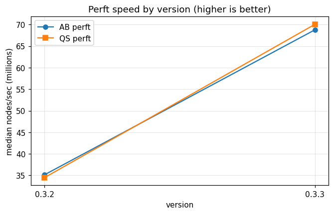
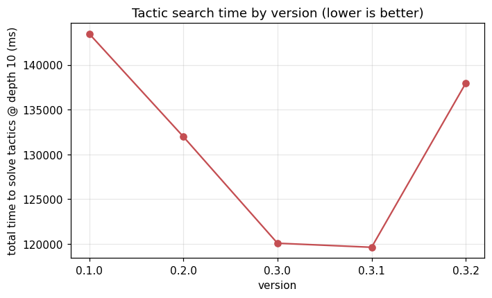
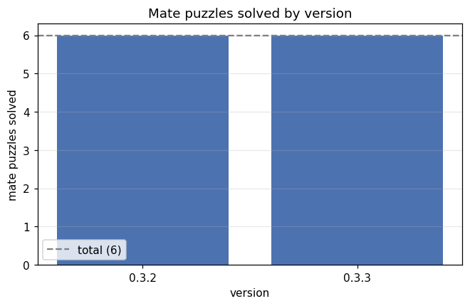
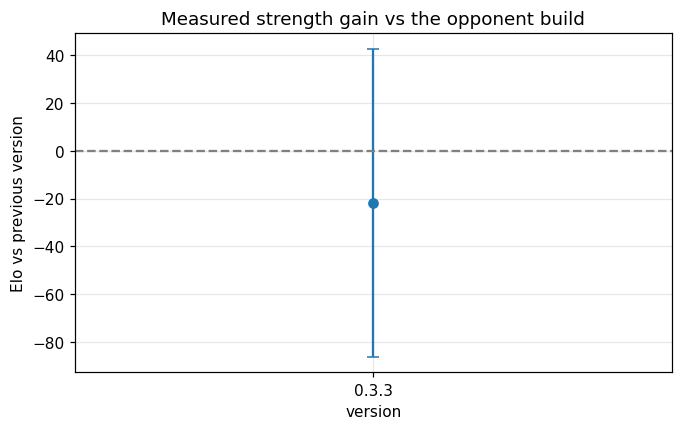

# TalsHand version progression report

_Generated by `scripts/generate_report.py` from `version_test_results/*.json`._

## Summary

| Version | AB Mnps | QS Mnps | Mates | Elo vs prev |
|---|---|---|---|---|
| 0.3.2 | 35.2 | 34.5 | 6/6 | - |
| 0.3.3 | 68.8 | 70.1 | 6/6 | -22 ± 64 |

## Perft speed

## Tactic search time

## Mate puzzles

## Strength gain (Elo)

